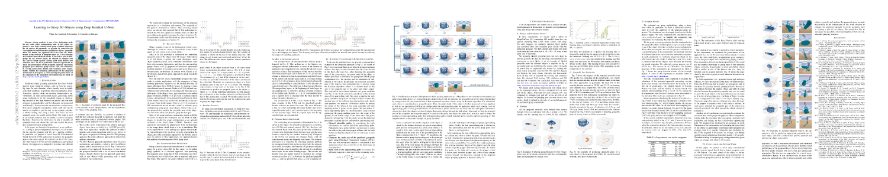

# Grasp Affordance Dataset (Pointcloud data)

###### Authors: Yikun Li, Lambert Schomaker, [Hamidreza Kasaei](https://hkasaei.github.io/)  
###### Department of Artificial Intelligence, University of Groningen, Groningen, The Netherlands.
###### Emails: {yikun.li, l.r.b.schomaker, hamidreza.kasaei}@rug.nl.
##
### Examples of models in the dataset:

This dataset contains 500 models as well as their grasp affordance from five categories (mug, lamp, chair, knife, and guitar).
25 example models with grasp affordance are shown below:


An animation example:


### Getting started

1. unzip the dataset.zip file.
1. run the model_reviewer.py viewing the models with grasp affordance.

## Paper
Latest version available on [arXiv](https://arxiv.org/abs/2002.03892) | [Video](https://youtu.be/5_yAJCc8owo)



Please adequately refer to the papers any time this code is being used. If you do publish a paper where this dataset helped your research, we encourage you to cite the following paper in your publications:

```
@inproceedings{li2020learning,
  title={Learning to grasp 3d objects using deep residual u-nets},
  author={Li, Yikun and Schomaker, Lambert and Kasaei, S Hamidreza},
  booktitle={2020 29th IEEE International Conference on Robot and Human Interactive Communication (RO-MAN)},
  pages={781--787},
  year={2020},
  organization={IEEE}
}
```
